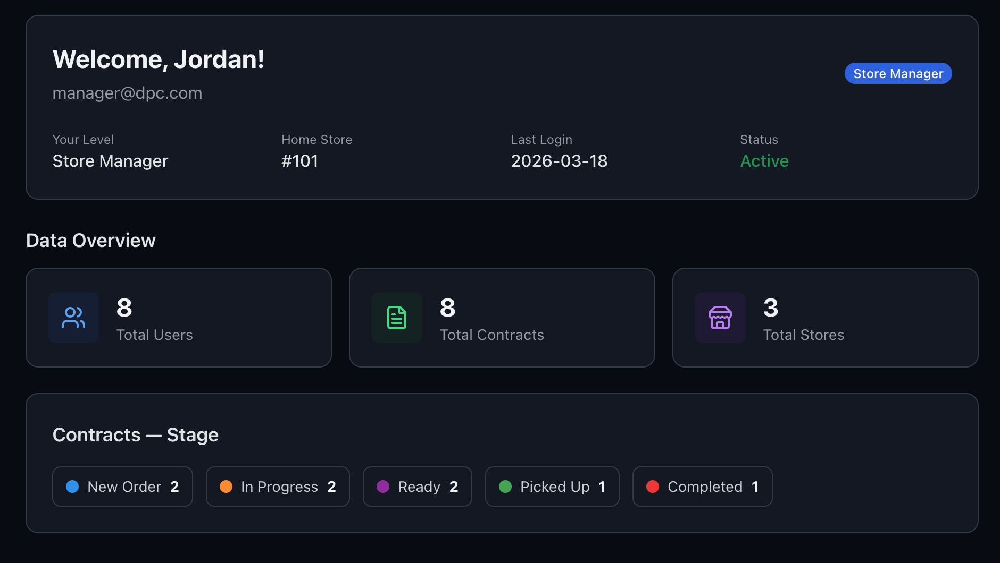

# Direct Property Care (DPC)

A contractor management and property maintenance platform built with Next.js. This demo application showcases role-based access control, contract pipeline tracking, store management, and more — all running client-side with seeded data.



## Tech Stack

- **Framework:** Next.js 14 (App Router)
- **Language:** TypeScript 5.4
- **Styling:** Tailwind CSS 3.4
- **Icons:** Lucide React
- **State Management:** React Context API

## Features

- **Role-Based Access Control** — Five user levels (Super Admin, Store Manager, Order Picker, Contractor, Client) with filtered navigation and data visibility
- **Contract Pipeline** — Track contracts through five stages: New Order → In Progress → Ready → Picked Up → Completed
- **Store Management** — View and manage multiple store locations across Canada
- **Member Management** — Enable/disable users, view statuses, and filter by role
- **Project Notes** — Create and manage task notes with due dates
- **Dark Mode** — Toggle between light and dark themes
- **Internationalization** — English and Spanish language support
- **Responsive Design** — Collapsible sidebar with mobile-friendly layout

## Getting Started

### Prerequisites

- Node.js 20.x or higher
- npm

### Installation

```bash
git clone <repository-url>
cd nextJS
npm install
```

### Development

```bash
npm run dev
```

Open [http://localhost:3000](http://localhost:3000) in your browser.

### Production Build

```bash
npm run build
npm start
```

## Demo Accounts

This app ships with seeded demo data. All changes are session-based and reset on logout.

| Role | Email | Password |
|------|-------|----------|
| Super Admin | admin@dpcnotreal.zx | admin123 |
| Store Manager | manager@dpcnotreal.zx | manager123 |
| Order Picker | picker@dpcnotreal.zx | picker123 |
| Contractor | contractor@dpcnotreal.zx | contractor123 |
| Client | client@dpcnotreal.zx | client123 |

## Project Structure

```
src/
├── app/
│   ├── (public)/          # Login, signup, forgot password
│   └── (dashboard)/       # Protected routes (profile, contracts, members, stores, etc.)
├── components/
│   ├── layout/            # Sidebar, Topbar
│   └── ui/                # StageBadge, LevelBadge, Snackbar
├── context/
│   └── AppContext.tsx      # Global state (auth, data, UI)
├── data/
│   └── seed.ts            # Demo users, stores, contracts, todos
├── lib/
│   ├── auth.ts            # Token creation & verification
│   └── translations.ts    # EN/ES translations
└── types/
    └── index.ts           # TypeScript interfaces & constants
```

## License

Private
